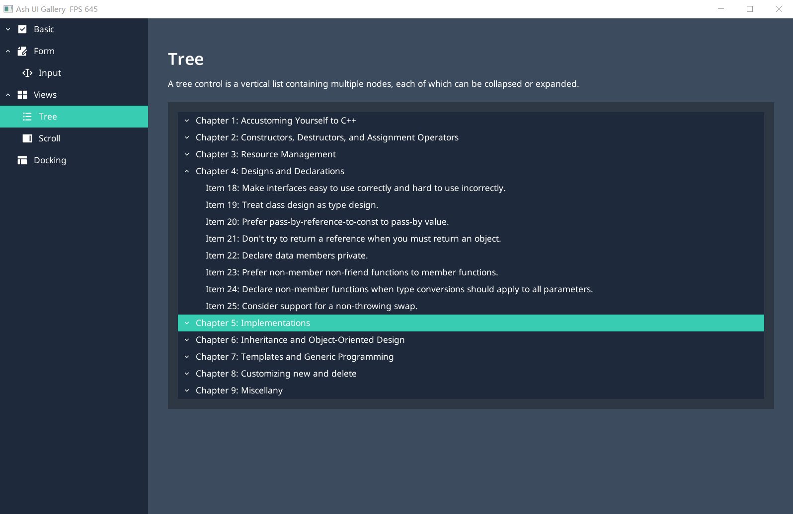

# Violet Game Engine

一个实验性质的项目。

## 环境需求

### Windows 10

- cmake version 3.25
- Vulkan

## 编译

```bash
git clone git@github.com:kzzkl/violet-engine.git

mkdir build
cd build
cmake -DCMAKE_INSTALL_PREFIX=./install ..
cmake --build ./ --config Debug --target install
```

## 项目结构

```
violet-engine
├───documents           文档
├───editor              引擎编辑器
├───engine              引擎代码
│   ├───common          通用的模块，断言、json、日志等
│   ├───core            计时器、子系统等
│   ├───ecs             ECS 框架
│   ├───graphics        渲染系统
│   ├───math            数学库，目前只有部分接口有 SIMD 实现
│   ├───misc            引擎内置的配置文件、资源等
│   ├───physics         物理系统
│   ├───plugin          插件目录，一些特性会用插件的方式实现
│   │   ├───bullet3     Bullet3 物理引擎
│   │   ├───d3d12       DirectX 12 RHI
│   │   └───vulkan      Vulkan RHI
│   ├───resource        资源系统，目前没有实现
│   ├───scene           场景系统，管理、更新场景中节点的坐标信息
│   ├───task            任务系统，引擎的多线程支持
│   ├───ui              UI 系统
│   └───window          对平台窗口的封装，目前只实现了 Win32 窗口
├───samples             示例，目前来说是用来验证引擎是否正常工作的测试程序
│   ├───mmd-viewer      一个 MikuMikuDance 的查看器，支持 PMX、VMD 格式
│   ├───physics         物理 Demo
│   ├───task            任务 Demo
│   └───ui              UI Demo
├───tests               单元测试
└───thirdparty          第三方库
```

## 一些截图

### MMD Viewer


### UI 

