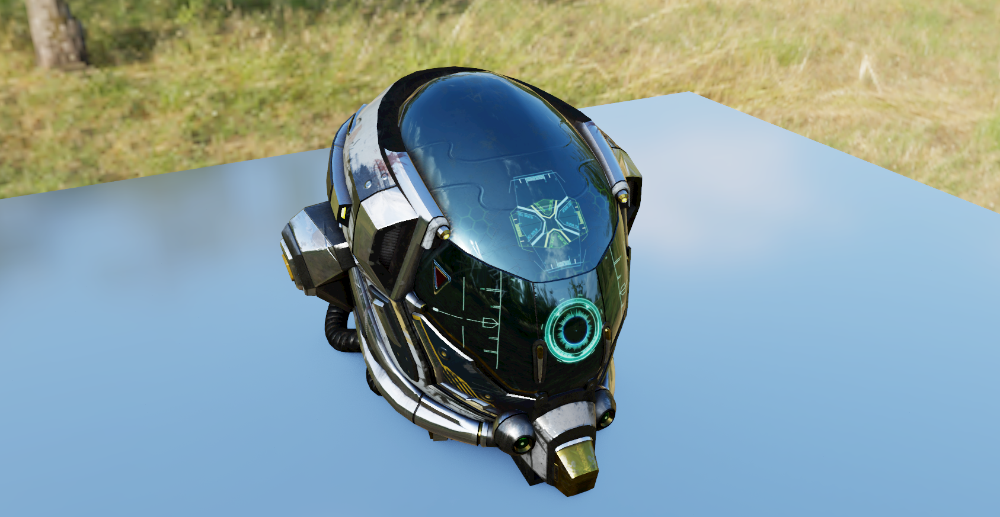
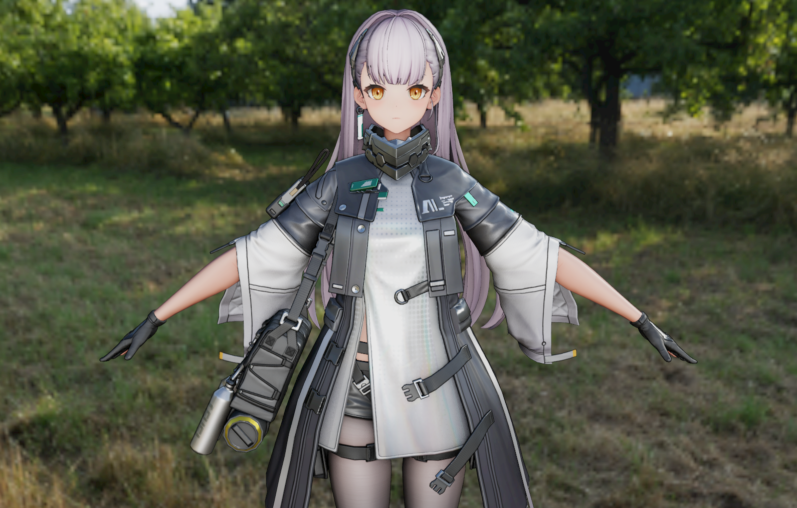

# Violet Engine

An experimental real-time rendering engine.

This project is work in progress:

- Many features are still under development or missing

- Expect bugs, instability, and incomplete implementations

- APIs and internal structures may change frequently

## Features

- ECS-based design

- Fully GPU-driven rendering pipeline

- Physically Based Rendering (PBR)

- Visibility Buffer rendering path

- Temporal Anti-Aliasing (TAA)

- Ground-Truth Ambient Occlusion (GTAO)

- Cluster LOD hierarchy

## Build & Run

### Dependencies

- CMake 3.25 or higher

- Vulkan SDK

### Build Instructions

```bash
git clone https://github.com/kzzkl/violet-engine.git --recursive

mkdir build
cd build
cmake -DCMAKE_INSTALL_PREFIX=./install ..
cmake --build ./ --config Debug --target install
```

After building the project, example programs will be generated under: `build/install/bin`

## Samples




